# 파이썬 데이터 분석

## 코로나 바이러스 감염 현황 분석
일자별 총 인구 대비 확진자 분석

## 데이터 가져오기
https://ourworldindata.org에서 원하는 데이터를 얻을 수 있다.

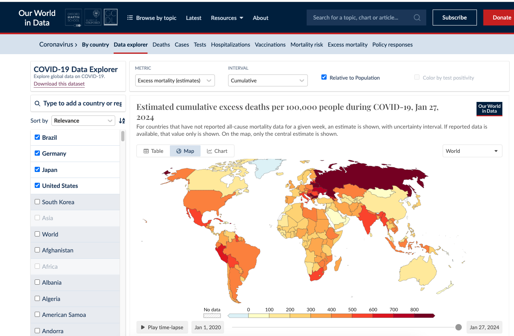

다운받은 데이터를 디렉토리에 옮겨준 뒤 명령어를 통해 csv파일을 읽을 수 있다.


```python
import pandas as pd

row_df = pd.read_csv('owid-covid-data.csv')
```

## 판다스를 통해 데이터 정제 및 가공하기

판다스 버전 확인은 다음 명령어로 가능하다
```python
import pandas as pd

pd.show_versions()
```

다음 명령어를 통해 원천 데이터 데이터프레임 정보를 확인한다.
```python
import pandas as pd

raw_df = pd.read_csv('owid-covid-data.csv')
raw_df.info()
```

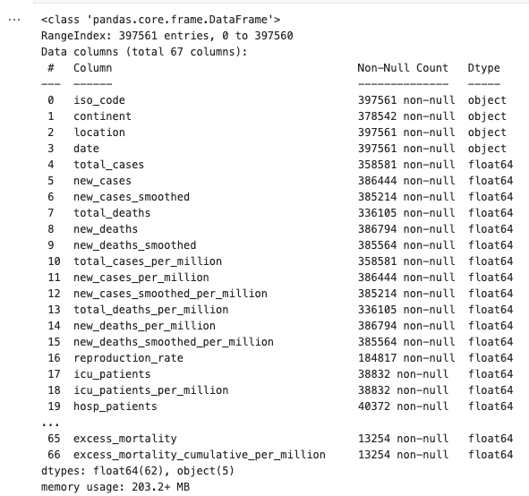

column, 타입 등 다양한 정보를 얻을 수 있다.


head()를 통해 데이터프레임의 일부 내용을 확인할 수 있다. (상위 5개 확인)
```python
import pandas as pd

raw_df = pd.read_csv('owid-covid-data.csv')
raw_df.head()
```
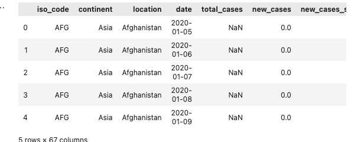

우리는 데이터의 원하는 열만 추려서 확인해야한다. dataframe에 [](bracket)연산을 통해 원하는 열의 데이터를 얻는다. []내부에 나열도 가능하다.

```python
import pandas as pd

raw_df = pd.read_csv('owid-covid-data.csv')
selected_columns = ['iso_code', 'location', 'data', 'total-cases', 'population']

revised_df = raw_df[selected_columns]
revised_df.head()
```
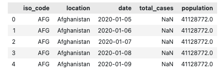


원하는 국가의 데이터를 출력하고자 한다면
```python
revised_df = revised_df[revised_df.location == 한국]
```

이라고 작성하면 되지만 우리는 대한민국이 데이터에서 어떤 이름으로 존재하는지 모르기 때문에 location column의 데이터들을 출력해야한다.


하지만 상위데이터를 뽑아 확인해본 결과 겹치는 국가의 데이터가 다수 존재하며 유일하게 1개씩 출력해야 모든 국가 이름을 확인할 수 있을 것이다. 따라서 unique 메서드를 통해 한국이 데이터에 어떤 이름으로 표기되어 있는지 확인해보자

```python
import pandas as pd

raw_df = pd.read_csv('owid-covid-data.csv')
selected_column = ['iso_code', 'location', 'date', 'total_cases', 'population']

revised_df = raw_df[selected_column]

locations = revised_df.location;
locations.unique()
```

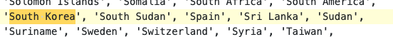

South Korea라는 이름으로 존재한다는 것을 확인했으므로 한국의 데이터를 출력해보자

```python
import pandas as pd

raw_df = pd.read_csv('owid-covid-data.csv')
selected_column = ['iso_code', 'location', 'date', 'total_cases', 'population']

revised_df = raw_df[selected_column]

revised_df[revised_df.location == 'South Korea'].head()
```

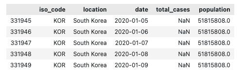

그럼이제 미국 데이터도 다음과 같은 과정으로 출력해보자

```python
import pandas as pd

raw_df = pd.read_csv('owid-covid-data.csv')
selected_column = ['iso_code', 'location', 'date', 'total_cases', 'population']

revised_df = raw_df[selected_column]

kor_df = revised_df[revised_df.location == 'South Korea']
us_df = revised_df[revised_df.location == 'United States']

us_df
```
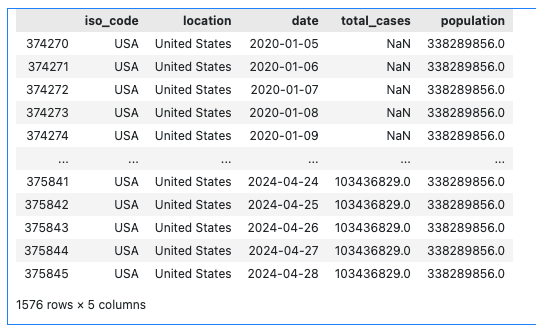

데이터프레임의 제일 왼쪽 열을 보면 인덱스 값으로 보이는 무의미한 값이 있다. 이것을 날짜로 바꿀 수 있으며 색인을 변경한다고 한다.

```python
import pandas as pd

raw_df = pd.read_csv('owid-covid-data.csv')
selected_column = ['iso_code', 'location', 'date', 'total_cases', 'population']

revised_df = raw_df[selected_column]

kor_df = revised_df[revised_df.location == 'South Korea']
kor_df_index_date = kor_df.set_index('date')

us_df = revised_df[revised_df.location == 'United States']
us_df_index_date = us_df.set_index('date')

us_df_index_date
```

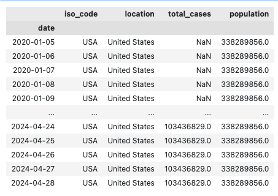

## 데이터 시각화
먼저 대한민국데이터의 시작 일과 끝일을 확인해보자

```python
import pandas as pd

raw_df = pd.read_csv('owid-covid-data.csv')
selected_column = ['iso_code', 'location', 'date', 'total_cases', 'population']

revised_df = raw_df[selected_column]

kor_df = revised_df[revised_df.location == 'South Korea']
kor_df_index_date = kor_df.set_index('date')
kor_total_cases = kor_df_index_date['total_cases']
```


2020-01-05 ~ 2024-04-28 까지의 정보가 있다. 미국 데이터는 어떨까

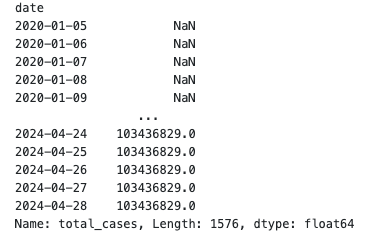

동일하다

그래프를 그리기 위한 최종 데이터 프레임을 만들어보자

```python
import pandas as pd

raw_df = pd.read_csv('owid-covid-data.csv')
selected_column = ['iso_code', 'location', 'date', 'total_cases', 'population']

revised_df = raw_df[selected_column]

kor_df = revised_df[revised_df.location == 'South Korea']
kor_df_index_date = kor_df.set_index('date')
kor_total_cases = kor_df_index_date['total_cases']

us_df = revised_df[revised_df.location == 'United States']
us_df_index_date = us_df.set_index('date')
us_total_cases = us_df_index_date['total_cases']

final_df = pd.DataFrame({
   'KOR': kor_total_cases,
   'USA': us_total_cases
}, index=kor_df_index_date.index)

final_df.tail()
```

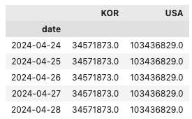


이제 최종적으로 얻은 데이터프레임을 이용하여 선그래프를 그려보자

```python
import pandas as pd

raw_df = pd.read_csv('owid-covid-data.csv')
selected_column = ['iso_code', 'location', 'date', 'total_cases', 'population']

revised_df = raw_df[selected_column]

kor_df = revised_df[revised_df.location == 'South Korea']
kor_df_index_date = kor_df.set_index('date')
kor_total_cases = kor_df_index_date['total_cases']

us_df = revised_df[revised_df.location == 'United States']
us_df_index_date = us_df.set_index('date')
us_total_cases = us_df_index_date['total_cases']

final_df = pd.DataFrame({
   'KOR': kor_total_cases,
   'USA': us_total_cases
}, index=kor_df_index_date.index)

final_df.plot.line(rot=45)
```
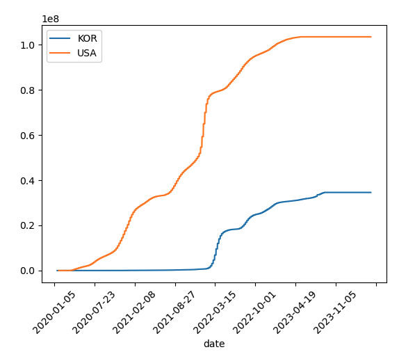


인덱스가 날짜이므로 슬라이싱 연산을 통해 원하는 기간동안의 데이터를 얻을 수 있다.

```python
import pandas as pd

raw_df = pd.read_csv('owid-covid-data.csv')
selected_column = ['iso_code', 'location', 'date', 'total_cases', 'population']

revised_df = raw_df[selected_column]

kor_df = revised_df[revised_df.location == 'South Korea']
kor_df_index_date = kor_df.set_index('date')
kor_total_cases = kor_df_index_date['total_cases']

us_df = revised_df[revised_df.location == 'United States']
us_df_index_date = us_df.set_index('date')
us_total_cases = us_df_index_date['total_cases']

final_df = pd.DataFrame({
   'KOR': kor_total_cases,
   'USA': us_total_cases
}, index=kor_df_index_date.index)

final_df['2022-01-01':].plot.line(rot=45)
```

우리의 목표는 일자별 총 인구대비 확진자 비율 분석이다. 현재 데이터에 의하면 미국의 코로나 확진자 비율이 더 큰 것 같지만, 인구수 대비 확진자수를 모르므로 미국이 인구수대비 확진자 수가 많다고 단정지을 수 없다. 따라서 한쪽으로 나누어주면 될 것 같다.

```python
import pandas as pd

raw_df = pd.read_csv('owid-covid-data.csv')
selected_column = ['iso_code', 'location', 'date', 'total_cases', 'population']

revised_df = raw_df[selected_column]

kor_df = revised_df[revised_df.location == 'South Korea']
kor_df_index_date = kor_df.set_index('date')
kor_total_cases = kor_df_index_date['total_cases']

us_df = revised_df[revised_df.location == 'United States']
us_df_index_date = us_df.set_index('date')
us_total_cases = us_df_index_date['total_cases']

kor_population = kor_df_index_date['population']['2020-01-22']
us_population = us_df_index_date['population']['2020-01-22']

rate = us_population / kor_population

final_df = pd.DataFrame({
   'KOR': kor_total_cases * rate,
   'USA': us_total_cases
}, index=kor_df_index_date.index)

final_df['2022-01-01':].plot.line(rot=45)
```

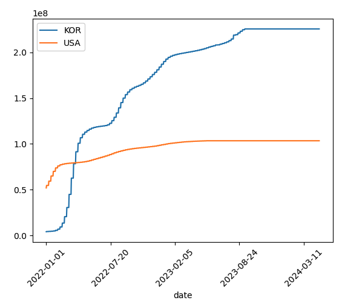

다음 그래프를 통해서 미국의 인구수 대비 확진자수가 한국보다 많다가 한국이 더 많아졌다는 것을 알 수 있다.

