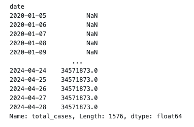

# 파이썬 데이터 분석

## 코로나 바이러스 감염 현황 분석
일자별 총 인구 대비 확진자 분석

## 데이터 가져오기
https://ourworldindata.org에서 원하는 데이터를 얻을 수 있다.


다운받은 데이터를 디렉토리에 옮겨준 뒤 명령어를 통해 csv파일을 읽을 수 있다.


```python
import pandas as pd

row_df = pd.read_csv('owid-covid-data.csv')
```

## 판다스를 통해 데이터 정제 및 가공하기

판다스 버전 확인은 다음 명령어로 가능하다
```python
import pandas as pd

pd.show_versions()
```

다음 명령어를 통해 원천 데이터 데이터프레임 정보를 확인한다.
```python
import pandas as pd

raw_df = pd.read_csv('owid-covid-data.csv')
raw_df.info()
```


column, 타입 등 다양한 정보를 얻을 수 있다.


head()를 통해 데이터프레임의 일부 내용을 확인할 수 있다. (상위 5개 확인)
```python
import pandas as pd

raw_df = pd.read_csv('owid-covid-data.csv')
raw_df.head()
```


우리는 데이터의 원하는 열만 추려서 확인해야한다. dataframe에 [](bracket)연산을 통해 원하는 열의 데이터를 얻는다. []내부에 나열도 가능하다.

```python
import pandas as pd

raw_df = pd.read_csv('owid-covid-data.csv')
selected_columns = ['iso_code', 'location', 'data', 'total-cases', 'population']

revised_df = raw_df[selected_columns]
revised_df.head()
```


원하는 국가의 데이터를 출력하고자 한다면
```python
revised_df = revised_df[revised_df.location == 한국]
```

이라고 작성하면 되지만 우리는 대한민국이 데이터에서 어떤 이름으로 존재하는지 모르기 때문에 location column의 데이터들을 출력해야한다.


하지만 상위데이터를 뽑아 확인해본 결과 겹치는 국가의 데이터가 다수 존재하며 유일하게 1개씩 출력해야 모든 국가 이름을 확인할 수 있을 것이다. 따라서 unique 메서드를 통해 한국이 데이터에 어떤 이름으로 표기되어 있는지 확인해보자

```python
import pandas as pd

raw_df = pd.read_csv('owid-covid-data.csv')
selected_column = ['iso_code', 'location', 'date', 'total_cases', 'population']

revised_df = raw_df[selected_column]

locations = revised_df.location;
locations.unique()
```


South Korea라는 이름으로 존재한다는 것을 확인했으므로 한국의 데이터를 출력해보자

```python
import pandas as pd

raw_df = pd.read_csv('owid-covid-data.csv')
selected_column = ['iso_code', 'location', 'date', 'total_cases', 'population']

revised_df = raw_df[selected_column]

revised_df[revised_df.location == 'South Korea'].head()
```


그럼이제 미국 데이터도 다음과 같은 과정으로 출력해보자

```python
import pandas as pd

raw_df = pd.read_csv('owid-covid-data.csv')
selected_column = ['iso_code', 'location', 'date', 'total_cases', 'population']

revised_df = raw_df[selected_column]

kor_df = revised_df[revised_df.location == 'South Korea']
us_df = revised_df[revised_df.location == 'United States']

us_df
```


데이터프레임의 제일 왼쪽 열을 보면 인덱스 값으로 보이는 무의미한 값이 있다. 이것을 날짜로 바꿀 수 있으며 색인을 변경한다고 한다.

```python
import pandas as pd

raw_df = pd.read_csv('owid-covid-data.csv')
selected_column = ['iso_code', 'location', 'date', 'total_cases', 'population']

revised_df = raw_df[selected_column]

kor_df = revised_df[revised_df.location == 'South Korea']
kor_df_index_date = kor_df.set_index('date')

us_df = revised_df[revised_df.location == 'United States']
us_df_index_date = us_df.set_index('date')

us_df_index_date
```


## 데이터 시각화
먼저 대한민국데이터의 시작 일과 끝일을 확인해보자

```python
import pandas as pd

raw_df = pd.read_csv('owid-covid-data.csv')
selected_column = ['iso_code', 'location', 'date', 'total_cases', 'population']

revised_df = raw_df[selected_column]

kor_df = revised_df[revised_df.location == 'South Korea']
kor_df_index_date = kor_df.set_index('date')
kor_total_cases = kor_df_index_date['total_cases']
```


2020-01-05 ~ 2024-04-28 까지의 정보가 있다. 미국 데이터는 어떨까


동일하다

그래프를 그리기 위한 최종 데이터 프레임을 만들어보자

```python
import pandas as pd

raw_df = pd.read_csv('owid-covid-data.csv')
selected_column = ['iso_code', 'location', 'date', 'total_cases', 'population']

revised_df = raw_df[selected_column]

kor_df = revised_df[revised_df.location == 'South Korea']
kor_df_index_date = kor_df.set_index('date')
kor_total_cases = kor_df_index_date['total_cases']

us_df = revised_df[revised_df.location == 'United States']
us_df_index_date = us_df.set_index('date')
us_total_cases = us_df_index_date['total_cases']

final_df = pd.DataFrame({
   'KOR': kor_total_cases,
   'USA': us_total_cases
}, index=kor_df_index_date.index)

final_df.tail()
```


이제 최종적으로 얻은 데이터프레임을 이용하여 선그래프를 그려보자

```python
import pandas as pd

raw_df = pd.read_csv('owid-covid-data.csv')
selected_column = ['iso_code', 'location', 'date', 'total_cases', 'population']

revised_df = raw_df[selected_column]

kor_df = revised_df[revised_df.location == 'South Korea']
kor_df_index_date = kor_df.set_index('date')
kor_total_cases = kor_df_index_date['total_cases']

us_df = revised_df[revised_df.location == 'United States']
us_df_index_date = us_df.set_index('date')
us_total_cases = us_df_index_date['total_cases']

final_df = pd.DataFrame({
   'KOR': kor_total_cases,
   'USA': us_total_cases
}, index=kor_df_index_date.index)

final_df.plot.line(rot=45)
```


인덱스가 날짜이므로 슬라이싱 연산을 통해 원하는 기간동안의 데이터를 얻을 수 있다.

```python
import pandas as pd

raw_df = pd.read_csv('owid-covid-data.csv')
selected_column = ['iso_code', 'location', 'date', 'total_cases', 'population']

revised_df = raw_df[selected_column]

kor_df = revised_df[revised_df.location == 'South Korea']
kor_df_index_date = kor_df.set_index('date')
kor_total_cases = kor_df_index_date['total_cases']

us_df = revised_df[revised_df.location == 'United States']
us_df_index_date = us_df.set_index('date')
us_total_cases = us_df_index_date['total_cases']

final_df = pd.DataFrame({
   'KOR': kor_total_cases,
   'USA': us_total_cases
}, index=kor_df_index_date.index)

final_df['2022-01-01':].plot.line(rot=45)
```

우리의 목표는 일자별 총 인구대비 확진자 비율 분석이다. 현재 데이터에 의하면 미국의 코로나 확진자 비율이 더 큰 것 같지만, 인구수 대비 확진자수를 모르므로 미국이 인구수대비 확진자 수가 많다고 단정지을 수 없다. 따라서 한쪽으로 나누어주면 될 것 같다.

```python
import pandas as pd

raw_df = pd.read_csv('owid-covid-data.csv')
selected_column = ['iso_code', 'location', 'date', 'total_cases', 'population']

revised_df = raw_df[selected_column]

kor_df = revised_df[revised_df.location == 'South Korea']
kor_df_index_date = kor_df.set_index('date')
kor_total_cases = kor_df_index_date['total_cases']

us_df = revised_df[revised_df.location == 'United States']
us_df_index_date = us_df.set_index('date')
us_total_cases = us_df_index_date['total_cases']

kor_population = kor_df_index_date['population']['2020-01-22']
us_population = us_df_index_date['population']['2020-01-22']

rate = us_population / kor_population

final_df = pd.DataFrame({
   'KOR': kor_total_cases * rate,
   'USA': us_total_cases
}, index=kor_df_index_date.index)

final_df['2022-01-01':].plot.line(rot=45)
```


다음 그래프를 통해서 미국의 인구수 대비 확진자수가 한국보다 많다가 한국이 더 많아졌다는 것을 알 수 있다.


# 머신러닝

# 들어가며
**머신러닝이란**
머신러닝은 특정 작업을 위해 프로그래밍할 필요 없이 컴퓨터에게 학습 방법을 가리치는 데 중점을 둔 AI의 하위 분야다.

## 머신러닝의 3가지 범주
- `지도학습`은 기계에 입력 데이터와 원하는 출력이 제공되는 것으로서, 목표는 기계가 이전에 관찰한 적이 없는 데이터에 대해 의미 있는 예측을 할 수 있는 방식으로 이러한 교육 예제에서 학습하는 것이다.
- `비지도 학습`은 기계에 입력 데이터만 제공되고 이후에 기계는 외부 지도나 입력 없이 자체적으로 의미 있는 구조를 찾는다.
- `강화학습`은 기계가 환경과 상호 작용하는 에이전트 역할을 한다. 기계는 원하는 방식으로 행동하면 `보상`을, 원하지 않는 방식으로 행동하면 `처벌`을 받는다. 기계는 그에 따라 행동을 개발하는 방법을 학습해 보상 극대화를 시도한다.

## 딥러닝의 역사# 1장 Tensorflow와 신경망의 기초

## 소개에서 제시한 1장의 내용
- Tensorflow의 기본사항
- 신경망, 딥러닝의 기초
- 다양한 도구 소개


## `Tensorflow(TF)`란 무엇인가
Tensorflow는 Google Brain팀에서 심층 신경망을 위해 개발한 오픈 소스 소프트웨어 라이브러리이다. 15년 11월 아파치 2.0라이선스로 만들어져 빠르게 성장했고 인지도가 엄청나다.

### 설명
Google은 이를 머신 인텔리전스를 위한 오픈 소스 소프트웨어 라이브러리라고 부른다. 다른 딥러닝 라이브러리인 PyTorch, Caffe, MxNet은 Tensorflow와 같이 자동 미분, CPU/GPU 옵션, 사전에 훈련된 모델, 순환(recurrent)신경망, 컨볼루션(convolution)신경망, 심층 신뢰(belief)신경망 등의 NN아키텍처를 지원한다. 그럼에도 Tensorflow의 장점은 다음과 같다.

- Tensorflow를 사용하면 모델을 배치하고 생산과정에서 쉽게 사용이 가능하다.
- Tensorflow2.0에는 정적 그래프에 기반한 그래프 연산과 함께 즉시 연산(eager computation)지원이 도입됐다.
- 강력한 커뮤니티의 지원을 받고 있다.

## `Keras`란 무엇인가
Keras는 딥러닝 모델을 만들고 훈련하기 위해 기초 구성 요소를 구성하는 유용한 API이다. -> Keras는 다양한 딥러닝 엔진에 통합할 수 있고 기초 구성요소를 구성하는 API이다.

## `신경망`을 간단히 소개함
신경망은 인간의 두뇌에서 영감을 얻은 방식으로 데이터를 처리하도록 컴퓨터를 가르치는 인공 지능 방식입니다. 인간의 두뇌와 비슷한 계층 구조로 상호 연결된 노드 또는 뉴런을 사용하는 딥 러닝이라고 불리는 기계 학습 과정의 유형입니다. 신경망은 컴퓨터가 실수에서 배우고 지속적으로 개선하는 데 사용하는 적응형 시스템을 생성합니다. 따라서 인공 신경망은 문서 요약 또는 얼굴 인식과 같은 복잡한 문제를 더 정확하게 해결하려고 합니다. (출처: https://aws.amazon.com/ko/what-is/neural-network/)


### 뉴런이란


인간의 뇌에는 수십억 개 이상의 뉴런이 있다. 뉴런은 화학 및 전기적 신호를 처리하고 전달하는 데 관여하는 인간의 뇌에서 서로 연결된 신경 세포이다. 가지돌기 dendrite는 다른 뉴런으로부터 정보를 받아 세포체 cell body를 거쳐 축삭 axon을 통해서 다른 뉴런으로 신호를 보낸다.

다음은 인공뉴런이다.


인공뉴런은 입력은 다른 인공뉴런으로부터 정보를 받아 노드를 거쳐 출력을 통해 다른 인공뉴런으로 신호를 보낸다. 인공신경세포들을 이어주어 정보를 주고 받게해주는 가중치도 있다.

가지돌기 = 입력, 시냅스 = 가중치, 세포체 = 노드, 축삭 = 출력

### `퍼셉트론`이란

퍼셉트론이란 사람의 뇌 신경세포(neuron)의 동작과정을 흉내내어 만든 수학적 모델이다.

퍼셉트론은 로젠 블렛이 1957년에 고안한 알고리즘이다. 퍼셉트론은 입력 데이터를 2개의 부류중 하나로 분류하는 분류기(classifier)이다. 퍼셉트론은 입력 특징 또는 간단히 특징이라 부르는 n개의 크기를 갖는 입력벡터가 주어지면 1또는 0을 출력하는 간단한 알고리즘이다.


### GPT의 이야기
퍼셉트론(Perceptron)은 인공 신경망(Artificial Neural Network, ANN)의 기본 단위인 인공 뉴런(Artificial Neuron)을 모델로 한 것으로, 이는 생물학적 뉴런을 모방한 것입니다. 인공 신경망에서의 계층(layer)은 생물학적 신경망에서 어떤 부분과 대응되는지 살펴보면, 다음과 같습니다.

1. **뉴런과 시냅스**:
   - **뉴런**: 인공 뉴런은 생물학적 뉴런과 유사하게 동작하며, 입력 신호를 받아서 처리하고, 결과를 출력합니다.
   - **시냅스**: 인공 신경망의 가중치(weight)는 생물학적 뉴런의 시냅스 역할을 합니다. 시냅스는 뉴런 간의 연결을 통해 신호를 전달하고, 이 과정에서 신호의 강도를 조절합니다.

2. **계층**:
   - **입력 계층(Input Layer)**: 이는 감각 신경(receptor neurons)에 해당합니다. 감각 신경은 외부 환경으로부터 자극을 받아들이고 이를 신호로 변환합니다.
   - **은닉 계층(Hidden Layers)**: 이는 뇌의 중간 뉴런(interneurons) 층에 해당합니다. 중간 뉴런은 감각 신경에서 받은 신호를 처리하고, 처리된 신호를 다음 계층으로 전달합니다. 은닉 계층은 입력 데이터의 복잡한 패턴을 학습하고, 이를 통해 더 높은 수준의 추상화를 수행합니다.
   - **출력 계층(Output Layer)**: 이는 운동 신경(motor neurons)에 해당합니다. 운동 신경은 처리된 신호를 받아서 신체의 근육이나 다른 조직으로 신호를 전달하여 행동을 유도합니다.

인간의 신경망에서 각 뉴런이 다양한 계층을 통해 정보를 전달하고 처리하는 것처럼, 인공 신경망에서도 계층을 통해 입력된 데이터를 처리하고, 이를 통해 학습을 수행합니다. 따라서 인공 신경망의 계층은 인간 신경망의 감각 신경, 중간 뉴런, 운동 신경 등의 기능적 부분에 대응된다고 할 수 있습니다.

다음 그림은 간단한 퍼셉트론 예시이다.


위 식에서 $w_{1}x_{1}$은 가중치이며 $beta$는 b로 표현하는 bias이다.

입력이 다음과 같다면


결국 벡터$w = (w_{1}, w_{2})$에 수직인 직선이 된다. 이를 3차원 공간에 표현하면
$z = w_{1}x + w_{2}y + b$가 되며 이는 평면의 방정식을 찾는 것과 같다. 이 평면은 공간상의 4점을 분리하는 평면의 방정식이다.


가중치 $w_{1}... w_{n}$ 들과 노드 $x_{1} ... x_{n}$ 끼리의 곱이 b보다 작거나 같은 경우 0 등으로 나타낸다.

출처: https://compmath.korea.ac.kr/deeplearning/Perceptron.html


```python
import tensorflow as tf
from tensorflow import keras
NB_CLASSES = 10 ### 인공 뉴런의 개수
RESHAPED = 784
model = tf.keras.models.Sequential()
model.add(keras.layers.Dense(NB_CLASSES, input_shape=(RESHAPED,), kernel_initializer='zeros', name='dense_layer', activation='softmax')
```

`NB_CLASSES`는 인공뉴런의 개수이고, `dense`라는 것은 각 계층의 뉴런이 이전 계층에 위치한 모든 뉴런과 완전 연결돼 있다는 것이다.
`kernel_initializer`는 각 인공뉴런의 가중치를 매개변수를 통해 초기화하는 함수이다.

## 다층 퍼셉트론

`단일 퍼셉트론`은 단일 선형 계층 모델에 붙여진 이름이다. AND, OR같은 선형적으로 구분가능한 데이터들에 대해서만 학습과 분류가 가능하다

이에 반해 `다층 퍼셉트론`은 여러 계층이 있는 경우이며, 입력과 출력 계층은 외부에서 볼 수 있지만 중간의 다른 모든 계층은 숨겨져(hidden)있어 볼 수 없다. 앞서 소개한 인간 신경망과의 비교관점에서 설명한 입력층, 은닉층, 출력층 개념이다.

`다층퍼셉트론(MLP)`는 단일 계층을 쌓아 얻을 수 있다.

1. 입력층에서 입력을 받는다.
2. 각 은닉층의 각 노드(세포체)에서 입력을 받아 선형함수에 연계된 값(시냅스)에 따라 (0, 1)값으로 발화(fire)한다.
3. 은닉층의 출력은 다른 은닉층으로 이동한다.
4. 출력층에서 출력된다.

이를 통해 `MLP`의 계층화된 구조는 인간 시각 체계의 조직과 유사하다는 점을 확인할 수 있다.

### 퍼셉트론 훈련의 문제점 해결책

단일 뉴런의 경우 가장 적절한 가중치`w`와 편향`b`을 찾기 위해 훈련의 예시를 제공하고 출력에서 발생하는 오류를 최소화하는 방식으로 `w`와 `b`를 결정해야 한다.

여러개의 뉴런이 있는 계층에서 `w`와 `b`를 찾는 다면 각 뉴런은 적절한 값을 찾기 위해서 `w`와 `b`를 조정할 것이다. 특정 입력에 대해서 `w`와 `b`를 `미세 조정`해야할 필요가 있을 것이고 그 때 퍼셉트론은 조금씩의 미세 조정이라는 것을 하지 못한다. 이로서 점진적인 학습이 불가능하다.(퍼셉트론은 0아니면 1이다)

점진적인 학습을 위해 0과 1로 `discreate`한 값이 아닌 `continuous`한 값이 필요하고 수학적으로는 `미분가능한` 함수가 필요하다는 것이다. 즉 `경사도(gradient)`를 통해 값을 미세하게 조정할 필요가 있다.

### 활성화 함수

활성화 함수(Activation Function)는 인공 신경망에서 뉴런의 출력을 결정하는 중요한 요소이다 입력 신호를 받아서 비선형 변환을 수행함으로써 신경망에 비선형성을 도입한다. 활성화 함수가 없다면, 신경망의 모든 계층이 단순히 선형 변환을 수행하게 되어, 깊은 신경망을 쌓아도 하나의 선형 변환과 다를 바 없게 된다. 주요 활성화 함수는 다음과 같다.

1. **시그모이드 함수(Sigmoid Function)**:
   - **수식**: $sigma(x) = \frac{1}{1 + e^{-x}}$
   - **출력 범위**: (0, 1)
   - **특징**: 출력이 0과 1 사이의 값으로 제한되어 확률을 표현하기에 적합하다. 그러나 큰 입력값이나 작은 입력값에서 기울기가 거의 0이 되어 학습이 느려질 수 있다.(기울기 소실 문제).

2. **하이퍼볼릭 탄젠트 함수(Tanh Function)**:
   - **수식**: $tanh(x) = \frac{e^x - e^{-x}}{e^x + e^{-x}}$
   - **출력 범위**: (-1, 1)
   - **특징**: 시그모이드 함수와 유사하지만 출력이 -1과 1 사이로 중심이 0에 가까워지므로 학습이 조금 더 빠르다. 그러나 여전히 큰 입력값에서 기울기 소실 문제가 발생할 수 있다.

3. **렐루 함수(ReLU, Rectified Linear Unit)**:
   - **수식**: $f(x) = \max(0, x)$
   - **출력 범위**: [0, ∞)
   - **특징**: 단순하고 계산이 빠르며, 기울기 소실 문제를 줄인다. 그러나 음수 입력에 대해 기울기가 0이 되어 뉴런이 죽어버리는 문제(죽은 렐루 문제)가 있을 수 있다.

4. **리키 렐루(Leaky ReLU)**:
- **수식**: $f(x) = \max(0.01x, x)$
   - **출력 범위**: (-∞, ∞)
   - **특징**: 음수 입력에 대해 작은 기울기를 유지함으로써 죽은 렐루 문제를 완화한다.

5. **소프트맥스 함수(Softmax Function)**:
   - **수식**: $\sigma(z)_i = \frac{e^{z_i}}{\sum_{j} e^{z_j}}$
   - **출력 범위**: (0, 1) (전체 출력의 합은 1)
   - **특징**: 출력층에서 주로 사용되며, 여러 클래스 중 하나를 선택하는 다중 클래스 분류 문제에서 각 클래스에 속할 확률을 출력한다.

활성화 함수의 선택은 신경망의 성능과 학습 속도에 큰 영향을 미치므로, 문제의 특성에 따라 적절한 활성화 함수를 선택하는 것이 중요하다.

### GPT의 이야기

활성화 함수를 인간의 신경망과 비교하면, 이는 인간의 뉴런이 특정 자극을 받았을 때 신호를 전달하는 방식과 유사합니다. 다음은 이와 관련된 비교입니다:

1. **활성화 함수의 역할**:
   - **인간의 신경망**: 생물학적 뉴런은 입력 신호가 특정 임계값을 초과할 때만 활성화되어 신호를 다음 뉴런으로 전달합니다. `이 임계값을 초과하지 않으면 신호를 전달하지 않습니다.`
   - **인공 신경망**: `활성화 함수는 입력 신호를 받아 비선형 변환을 적용하여 출력 신호를 생성합니다.` 이 변환은 신경망에 비선형성을 도입하여 복잡한 패턴을 학습할 수 있게 합니다.

2. **시그모이드 함수와 인간의 뉴런**:
   - **인간의 신경망**: `뉴런의 활성화는 특정 자극이 누적되어 임계값을 초과할 때 발생합니다.` 이는 뉴런의 모든 입력 신호가 일정 수준을 넘어야 다음 뉴런으로 신호가 전달되는 방식입니다.
   - **인공 신경망**: 시그모이드 함수는 입력 신호를 0과 1 사이의 값으로 변환하여 출력합니다. 이는 뉴런이 `활성화되는지 여부를 확률적으로 나타내는 것과 유사합니다.`

3. **ReLU 함수와 인간의 뉴런**:
   - **인간의 신경망**: 뉴런은 `특정 자극`이 주어졌을 때만 `활성화`되고, 자극이 없으면 `비활성` 상태를 유지합니다.
   - **인공 신경망**: ReLU 함수는 입력이 `양수`일 때만 활성화되고, 음수일 때는 `0`을 출력합니다. `이는 뉴런이 특정 자극에 반응하는 방식과 유사합니다.`

4. **비선형성의 도입**:
   - **인간의 신경망**: 생물학적 뉴런의 반응은 단순한 선형 관계가 아니라 `복잡한 비선형성`을 띱니다. 이는 다양한 입력 신호가 합쳐져 복잡한 반응을 만들어내기 때문입니다.
   - **인공 신경망**: 활성화 함수는 입력 신호를 비선형적으로 변환함으로써, 신경망이 복잡한 패턴과 `비선형 관계`를 학습할 수 있게 합니다.

5. **학습과 적응**:
   - **인간의 신경망**: 시냅스의 가중치는 `학습과 경험에 따라 변화`합니다. 이는 뉴런 간의 연결 강도가 변화하여 학습된 정보를 저장하고, 적응하는 과정을 나타냅니다.
   - **인공 신경망**: `신경망의 가중치는 학습 과정에서 최적화 알고리즘`을 통해 조정됩니다. 활성화 함수는 이 과정에서 중요한 역할을 하며, 입력 신호의 중요성을 반영합니다.

결론적으로, 활성화 함수는 생물학적 뉴런의 활성화 메커니즘을 모방하여 인공 신경망에 비선형성을 도입하고, 학습과 적응을 가능하게 합니다. 이를 통해 인공 신경망은 복잡한 패턴을 학습하고 다양한 문제를 해결할 수 있게 됩니다.
딥러닝은 12년에 전 세계를 강타했다. 이때 챌린지는 손으로 라벨을 붙인 대규모 데이터셋의 하위 집합을 사용해 사진의 내용을 예측하는 것을 목표로하였다. 오류율 15.3%를 달성했으며 기술 산업 전반의 관심을 갖게 되었다.

점점 더 많은 도메인에서 딥러닝 기술은 이전 방법으로 불가능했던 정확도 수준으로 문제를 해결할 수 있었다.

이책은 먼저 간단한 모델로시작해 점점 더 정교한 모델을 점진적으로 도입한다.

# 1장 Tensorflow와 신경망의 기초

## 소개에서 제시한 1장의 내용
- Tensorflow의 기본사항
- 신경망, 딥러닝의 기초
- 다양한 도구 소개


## `Tensorflow(TF)`란 무엇인가
Tensorflow는 Google Brain팀에서 심층 신경망을 위해 개발한 오픈 소스 소프트웨어 라이브러리이다. 15년 11월 아파치 2.0라이선스로 만들어져 빠르게 성장했고 인지도가 엄청나다.

### 설명
Google은 이를 머신 인텔리전스를 위한 오픈 소스 소프트웨어 라이브러리라고 부른다. 다른 딥러닝 라이브러리인 PyTorch, Caffe, MxNet은 Tensorflow와 같이 자동 미분, CPU/GPU 옵션, 사전에 훈련된 모델, 순환(recurrent)신경망, 컨볼루션(convolution)신경망, 심층 신뢰(belief)신경망 등의 NN아키텍처를 지원한다. 그럼에도 Tensorflow의 장점은 다음과 같다.

- Tensorflow를 사용하면 모델을 배치하고 생산과정에서 쉽게 사용이 가능하다.
- Tensorflow2.0에는 정적 그래프에 기반한 그래프 연산과 함께 즉시 연산(eager computation)지원이 도입됐다.
- 강력한 커뮤니티의 지원을 받고 있다.

## `Keras`란 무엇인가
Keras는 딥러닝 모델을 만들고 훈련하기 위해 기초 구성 요소를 구성하는 유용한 API이다. -> Keras는 다양한 딥러닝 엔진에 통합할 수 있고 기초 구성요소를 구성하는 API이다.

## `신경망`을 간단히 소개함
신경망은 인간의 두뇌에서 영감을 얻은 방식으로 데이터를 처리하도록 컴퓨터를 가르치는 인공 지능 방식입니다. 인간의 두뇌와 비슷한 계층 구조로 상호 연결된 노드 또는 뉴런을 사용하는 딥 러닝이라고 불리는 기계 학습 과정의 유형입니다. 신경망은 컴퓨터가 실수에서 배우고 지속적으로 개선하는 데 사용하는 적응형 시스템을 생성합니다. 따라서 인공 신경망은 문서 요약 또는 얼굴 인식과 같은 복잡한 문제를 더 정확하게 해결하려고 합니다. (출처: https://aws.amazon.com/ko/what-is/neural-network/)


### 뉴런이란


인간의 뇌에는 수십억 개 이상의 뉴런이 있다. 뉴런은 화학 및 전기적 신호를 처리하고 전달하는 데 관여하는 인간의 뇌에서 서로 연결된 신경 세포이다. 가지돌기 dendrite는 다른 뉴런으로부터 정보를 받아 세포체 cell body를 거쳐 축삭 axon을 통해서 다른 뉴런으로 신호를 보낸다.

다음은 인공뉴런이다.


인공뉴런은 입력은 다른 인공뉴런으로부터 정보를 받아 노드를 거쳐 출력을 통해 다른 인공뉴런으로 신호를 보낸다. 인공신경세포들을 이어주어 정보를 주고 받게해주는 가중치도 있다.

가지돌기 = 입력, 시냅스 = 가중치, 세포체 = 노드, 축삭 = 출력

### `퍼셉트론`이란

퍼셉트론이란 사람의 뇌 신경세포(neuron)의 동작과정을 흉내내어 만든 수학적 모델이다.

퍼셉트론은 로젠 블렛이 1957년에 고안한 알고리즘이다. 퍼셉트론은 입력 데이터를 2개의 부류중 하나로 분류하는 분류기(classifier)이다. 퍼셉트론은 입력 특징 또는 간단히 특징이라 부르는 n개의 크기를 갖는 입력벡터가 주어지면 1또는 0을 출력하는 간단한 알고리즘이다.


### GPT의 이야기
퍼셉트론(Perceptron)은 인공 신경망(Artificial Neural Network, ANN)의 기본 단위인 인공 뉴런(Artificial Neuron)을 모델로 한 것으로, 이는 생물학적 뉴런을 모방한 것입니다. 인공 신경망에서의 계층(layer)은 생물학적 신경망에서 어떤 부분과 대응되는지 살펴보면, 다음과 같습니다.

1. **뉴런과 시냅스**:
   - **뉴런**: 인공 뉴런은 생물학적 뉴런과 유사하게 동작하며, 입력 신호를 받아서 처리하고, 결과를 출력합니다.
   - **시냅스**: 인공 신경망의 가중치(weight)는 생물학적 뉴런의 시냅스 역할을 합니다. 시냅스는 뉴런 간의 연결을 통해 신호를 전달하고, 이 과정에서 신호의 강도를 조절합니다.

2. **계층**:
   - **입력 계층(Input Layer)**: 이는 감각 신경(receptor neurons)에 해당합니다. 감각 신경은 외부 환경으로부터 자극을 받아들이고 이를 신호로 변환합니다.
   - **은닉 계층(Hidden Layers)**: 이는 뇌의 중간 뉴런(interneurons) 층에 해당합니다. 중간 뉴런은 감각 신경에서 받은 신호를 처리하고, 처리된 신호를 다음 계층으로 전달합니다. 은닉 계층은 입력 데이터의 복잡한 패턴을 학습하고, 이를 통해 더 높은 수준의 추상화를 수행합니다.
   - **출력 계층(Output Layer)**: 이는 운동 신경(motor neurons)에 해당합니다. 운동 신경은 처리된 신호를 받아서 신체의 근육이나 다른 조직으로 신호를 전달하여 행동을 유도합니다.

인간의 신경망에서 각 뉴런이 다양한 계층을 통해 정보를 전달하고 처리하는 것처럼, 인공 신경망에서도 계층을 통해 입력된 데이터를 처리하고, 이를 통해 학습을 수행합니다. 따라서 인공 신경망의 계층은 인간 신경망의 감각 신경, 중간 뉴런, 운동 신경 등의 기능적 부분에 대응된다고 할 수 있습니다.

다음 그림은 간단한 퍼셉트론 예시이다.


위 식에서 $w_{1}x_{1}$은 가중치이며 $beta$는 b로 표현하는 bias이다.

입력이 다음과 같다면


결국 벡터$w = (w_{1}, w_{2})$에 수직인 직선이 된다. 이를 3차원 공간에 표현하면
$z = w_{1}x + w_{2}y + b$가 되며 이는 평면의 방정식을 찾는 것과 같다. 이 평면은 공간상의 4점을 분리하는 평면의 방정식이다.


가중치 $w_{1}... w_{n}$ 들과 노드 $x_{1} ... x_{n}$ 끼리의 곱이 b보다 작거나 같은 경우 0 등으로 나타낸다.

출처: https://compmath.korea.ac.kr/deeplearning/Perceptron.html


```python
import tensorflow as tf
from tensorflow import keras
NB_CLASSES = 10 ### 인공 뉴런의 개수
RESHAPED = 784
model = tf.keras.models.Sequential()
model.add(keras.layers.Dense(NB_CLASSES, input_shape=(RESHAPED,), kernel_initializer='zeros', name='dense_layer', activation='softmax')
```

`NB_CLASSES`는 인공뉴런의 개수이고, `dense`라는 것은 각 계층의 뉴런이 이전 계층에 위치한 모든 뉴런과 완전 연결돼 있다는 것이다.
`kernel_initializer`는 각 인공뉴런의 가중치를 매개변수를 통해 초기화하는 함수이다.

## 다층 퍼셉트론

`단일 퍼셉트론`은 단일 선형 계층 모델에 붙여진 이름이다. AND, OR같은 선형적으로 구분가능한 데이터들에 대해서만 학습과 분류가 가능하다

이에 반해 `다층 퍼셉트론`은 여러 계층이 있는 경우이며, 입력과 출력 계층은 외부에서 볼 수 있지만 중간의 다른 모든 계층은 숨겨져(hidden)있어 볼 수 없다. 앞서 소개한 인간 신경망과의 비교관점에서 설명한 입력층, 은닉층, 출력층 개념이다.

`다층퍼셉트론(MLP)`는 단일 계층을 쌓아 얻을 수 있다.

1. 입력층에서 입력을 받는다.
2. 각 은닉층의 각 노드(세포체)에서 입력을 받아 선형함수에 연계된 값(시냅스)에 따라 (0, 1)값으로 발화(fire)한다.
3. 은닉층의 출력은 다른 은닉층으로 이동한다.
4. 출력층에서 출력된다.

이를 통해 `MLP`의 계층화된 구조는 인간 시각 체계의 조직과 유사하다는 점을 확인할 수 있다.

### 퍼셉트론 훈련의 문제점 해결책

단일 뉴런의 경우 가장 적절한 가중치`w`와 편향`b`을 찾기 위해 훈련의 예시를 제공하고 출력에서 발생하는 오류를 최소화하는 방식으로 `w`와 `b`를 결정해야 한다.

여러개의 뉴런이 있는 계층에서 `w`와 `b`를 찾는 다면 각 뉴런은 적절한 값을 찾기 위해서 `w`와 `b`를 조정할 것이다. 특정 입력에 대해서 `w`와 `b`를 `미세 조정`해야할 필요가 있을 것이고 그 때 퍼셉트론은 조금씩의 미세 조정이라는 것을 하지 못한다. 이로서 점진적인 학습이 불가능하다.(퍼셉트론은 0아니면 1이다)

점진적인 학습을 위해 0과 1로 `discreate`한 값이 아닌 `continuous`한 값이 필요하고 수학적으로는 `미분가능한` 함수가 필요하다는 것이다. 즉 `경사도(gradient)`를 통해 값을 미세하게 조정할 필요가 있다.

### 활성화 함수

활성화 함수(Activation Function)는 인공 신경망에서 뉴런의 출력을 결정하는 중요한 요소이다 입력 신호를 받아서 비선형 변환을 수행함으로써 신경망에 비선형성을 도입한다. 활성화 함수가 없다면, 신경망의 모든 계층이 단순히 선형 변환을 수행하게 되어, 깊은 신경망을 쌓아도 하나의 선형 변환과 다를 바 없게 된다. 주요 활성화 함수는 다음과 같다.

1. **시그모이드 함수(Sigmoid Function)**:
   - **수식**: $sigma(x) = \frac{1}{1 + e^{-x}}$
   - **출력 범위**: (0, 1)
   - **특징**: 출력이 0과 1 사이의 값으로 제한되어 확률을 표현하기에 적합하다. 그러나 큰 입력값이나 작은 입력값에서 기울기가 거의 0이 되어 학습이 느려질 수 있다.(기울기 소실 문제).

2. **하이퍼볼릭 탄젠트 함수(Tanh Function)**:
   - **수식**: $tanh(x) = \frac{e^x - e^{-x}}{e^x + e^{-x}}$
   - **출력 범위**: (-1, 1)
   - **특징**: 시그모이드 함수와 유사하지만 출력이 -1과 1 사이로 중심이 0에 가까워지므로 학습이 조금 더 빠르다. 그러나 여전히 큰 입력값에서 기울기 소실 문제가 발생할 수 있다.

3. **렐루 함수(ReLU, Rectified Linear Unit)**:
   - **수식**: $f(x) = \max(0, x)$
   - **출력 범위**: [0, ∞)
   - **특징**: 단순하고 계산이 빠르며, 기울기 소실 문제를 줄인다. 그러나 음수 입력에 대해 기울기가 0이 되어 뉴런이 죽어버리는 문제(죽은 렐루 문제)가 있을 수 있다.

4. **리키 렐루(Leaky ReLU)**:
- **수식**: $f(x) = \max(0.01x, x)$
   - **출력 범위**: (-∞, ∞)
   - **특징**: 음수 입력에 대해 작은 기울기를 유지함으로써 죽은 렐루 문제를 완화한다.

5. **소프트맥스 함수(Softmax Function)**:
   - **수식**: $\sigma(z)_i = \frac{e^{z_i}}{\sum_{j} e^{z_j}}$
   - **출력 범위**: (0, 1) (전체 출력의 합은 1)
   - **특징**: 출력층에서 주로 사용되며, 여러 클래스 중 하나를 선택하는 다중 클래스 분류 문제에서 각 클래스에 속할 확률을 출력한다.

활성화 함수의 선택은 신경망의 성능과 학습 속도에 큰 영향을 미치므로, 문제의 특성에 따라 적절한 활성화 함수를 선택하는 것이 중요하다.

### GPT의 이야기

활성화 함수를 인간의 신경망과 비교하면, 이는 인간의 뉴런이 특정 자극을 받았을 때 신호를 전달하는 방식과 유사합니다. 다음은 이와 관련된 비교입니다:

1. **활성화 함수의 역할**:
   - **인간의 신경망**: 생물학적 뉴런은 입력 신호가 특정 임계값을 초과할 때만 활성화되어 신호를 다음 뉴런으로 전달합니다. `이 임계값을 초과하지 않으면 신호를 전달하지 않습니다.`
   - **인공 신경망**: `활성화 함수는 입력 신호를 받아 비선형 변환을 적용하여 출력 신호를 생성합니다.` 이 변환은 신경망에 비선형성을 도입하여 복잡한 패턴을 학습할 수 있게 합니다.

2. **시그모이드 함수와 인간의 뉴런**:
   - **인간의 신경망**: `뉴런의 활성화는 특정 자극이 누적되어 임계값을 초과할 때 발생합니다.` 이는 뉴런의 모든 입력 신호가 일정 수준을 넘어야 다음 뉴런으로 신호가 전달되는 방식입니다.
   - **인공 신경망**: 시그모이드 함수는 입력 신호를 0과 1 사이의 값으로 변환하여 출력합니다. 이는 뉴런이 `활성화되는지 여부를 확률적으로 나타내는 것과 유사합니다.`

3. **ReLU 함수와 인간의 뉴런**:
   - **인간의 신경망**: 뉴런은 `특정 자극`이 주어졌을 때만 `활성화`되고, 자극이 없으면 `비활성` 상태를 유지합니다.
   - **인공 신경망**: ReLU 함수는 입력이 `양수`일 때만 활성화되고, 음수일 때는 `0`을 출력합니다. `이는 뉴런이 특정 자극에 반응하는 방식과 유사합니다.`

4. **비선형성의 도입**:
   - **인간의 신경망**: 생물학적 뉴런의 반응은 단순한 선형 관계가 아니라 `복잡한 비선형성`을 띱니다. 이는 다양한 입력 신호가 합쳐져 복잡한 반응을 만들어내기 때문입니다.
   - **인공 신경망**: 활성화 함수는 입력 신호를 비선형적으로 변환함으로써, 신경망이 복잡한 패턴과 `비선형 관계`를 학습할 수 있게 합니다.

5. **학습과 적응**:
   - **인간의 신경망**: 시냅스의 가중치는 `학습과 경험에 따라 변화`합니다. 이는 뉴런 간의 연결 강도가 변화하여 학습된 정보를 저장하고, 적응하는 과정을 나타냅니다.
   - **인공 신경망**: `신경망의 가중치는 학습 과정에서 최적화 알고리즘`을 통해 조정됩니다. 활성화 함수는 이 과정에서 중요한 역할을 하며, 입력 신호의 중요성을 반영합니다.

결론적으로, 활성화 함수는 생물학적 뉴런의 활성화 메커니즘을 모방하여 인공 신경망에 비선형성을 도입하고, 학습과 적응을 가능하게 합니다. 이를 통해 인공 신경망은 복잡한 패턴을 학습하고 다양한 문제를 해결할 수 있게 됩니다.

### 책의 전반적인 내용을 이용한 필기체인식 예제

책의 후반부 내용을 압축한 예제이므로 코드의 세부적인 이해를 위해 애쓰지말자

필기체 숫자를 인식하는 신경망을 만들기 위해 60000개의 데이터와 10000개의 테스트 데이터로 구성된 데이터베이스를 사용하며 각각의 훈련데이터는 사람들이 실제 정답을 기록해두었다. 이는 정답이 주어진 데이터셋이므로 `지도(supervised)학습`이라고 한다. 테스트 데이터는 신경망을 테스트하는 데 사용한다.

각각의 이미지는 28 * 28픽셀로 구성되어 있다.

### One-Hot Encoding
범주형 특징을 숫자형으로 변환하여 수치형으로 처리할 때의 이점을 이용할 수 있다. 

가령 [0-9]까지 갖는 범주형 특징 수는 10개의 위치를 갖는 이진벡터로 구성해 인코딩할 수 있다.

```
0 : [1, 0, 0, 0, 0, 0, 0, 0, 0, 0]
7 : [0, 0, 0, 0, 0, 0, 0, 1, 0, 0]
```

#### 사용되는 변수 설명
- X_train : 훈련 데이터 집합
- X_test : 신경망의 성능을 평가하는 테스트 집합
- EPOCH : 훈련을 얼마나 지속할 것인지
- BATCH_SIZE : 한 번에 신명망에 입력하는 표본의 수
- VALICATION : 훈련 프로세스의 유효성을 확인하기 위해 남겨둔 데이터의 양(비율)

#### 코드내용
1. X_train은 60000개의 행으로 28*28값을 가진다. 이를 60000*784형태로 변환한다.

```python
REASHAPED = 784
...
X_train = X_train.reshape(60000, RESHAPED)
X_test = X_test.reshape(10000, RESHAPED)
```

2. 각 픽셀과 관련된 값은 [0, 1]범위로 정규화된다.(최대강도 255로 나눠 0과 1사이 범위로 정규화)
```python
X_train /= 255
X_test /= 255
```
3. 레이블을 One-Hot encoding한다
```python
Y_train = tf.keras.utils.to_categorical(Y_train, NB_CLASSES)
```

4. 모델 구축
```python
model = tf.keras.models.Sequential()
model.add(keras.layers.Dense(NB_CLASSES,
            input_shape=(RESHAPED,),
            name='dense_layer',
            activation='softmax'
))
```

마지막 계층은 활성화 함수가 `softmax인` 단일 뉴런으로, 이는 `sigmoid` 함수를 일반화한 것이다. 따라서 이전 내용으로 생각해보면 다른 뉴런으로 신호가 전파될 때 활성화되는지 여부를 결정하는 활성화함수를 마지막 계층에 놓은 것을 확인할 수 있다.

`밀집계층`으로 각 계층의 뉴런들은 다음 계층의 뉴런들과 완벽하게 연결되어 있는 것을 알 수 있다.

### 모델을 정의한 후에는
Tensorflow에서 실행할 수 있도록 모델을 컴파일해야 한다. 컴파일 중에 몇 가지 설정 사항이 있다.

1. 최적기(optimizer)선택
2. 최적기가 가중치 공간을 탐색하기 위해 사용할 목적함수(objective function) 선택, loss functions or cost functions라고 함
   MSE : 예측과 실젯값 사이의 평균제곱오차를 정의한다. 이 목적함수는 각 예측에서 발생한 모든 오류의 평균이 된다는 점을 주목해야한다.
   
   

   ### 모두의 딥러닝 내용
   $H(x)=Wx+b$에서 $W$와 $b$값을 모르므로 $random$한 값을 이용한다.

   $cost(W, b) = \frac{1}{m}\displaystyle\sum_{i=0}^{m}{(H(x^{(i)})-y^{(i)})^2}$

   cost를 최소화 하는 $W$, $b$결정이 목표


   만약 b가 0이라면

   $H(x)=Wx$ 이고
   $cost(W, b) = \frac{1}{m}\displaystyle\sum_{i=0}^{m}{(Wx^{(i)}-y^{(i)})^2}$ 이다

   $W$는 우리가 구하기 위해서 달려가는 목표임 당연히 cost값이 처음엔 큰게 당연함

   ### Cost function의 그래프 개형은?

   $W$가 x축이라고 하고 training data가

   $cost(W) = \frac{(W - 1)^2 + (2W - 2)^2 + (3W - 3)^2}{m}$
   으로 계산했다. 따라서 이차함수 개형일 듯 하다

   위 cost function에서 W를 찾는 것이다

   ### Gradient descent algorithm

   경사를 따라 내려가는 알고리즘이다. 주어진 cost function을 minimize하는 알고리즘이다.

   - 아무 점에서 시작 가능하다.
   - W를 경사도에 따라서 감소시킨다.
   

   $cost(W, b) = \frac{1}{2m}\displaystyle\sum_{i=0}^{m}{(Wx^{(i)}-y^{(i)})^2}$ 을 미분하면

   $W := W - \alpha\frac{\partial}{\partial W}cost(W)$

   $W := W - \alpha\frac{\partial}{\partial W}\frac{1}{2m}\displaystyle\sum_{i=0}^{m}{(Wx^{(i)}-y^{(i)})^2}$

   $W := W - \alpha\frac{\partial}{\partial W}\frac{1}{2m}\displaystyle\sum_{i=0}^{m}{2(Wx^{(i)}-y^{(i)})x^{(i)}}$

   $W := W - \alpha\frac{\partial}{\partial W}\frac{1}{m}\displaystyle\sum_{i=0}^{m}{(Wx^{(i)}-y^{(i)})x^{(i)}}$

   만약 기울기가 음수라면 $W := W_{q} > 0$ 이는 minimize하기 위해 $W$를 증가시킨다는 것이다.

   $\alpha$는 learning lat?? 이라고 하며 상수라고 한다고 함

   경사도는 시작 위치에 따라 달라질 수 있음

   우리의 cost function과 hypothesis로 그림을 그리면 Convex function 형태가 나오며
   어느 점에서 시작하든 $W$와 $b$가 같음. 따라서 cost function 이 Convex function형태면 Gradient descent algorithm을 
   사용할 수 있다.

   MSE말고도 이진_교차엔트로피, 범주_교차엔트로피 등이 있다.

   `loss function(cost function)은 신경망을 최적화하는 데 사용된다.`
3. 훈련된 모델 평가
   #### 측도 (metrics)
   `정확도(Accuracy)`: 타깃 대비 정확한 예측을 한 비율을 정의한다.
   `정밀도(Percision)`: 긍정으로 예측한 것 중 `실제로 참`인 것의 비율이다.
   `재현률(Recall)`: 올바로 예측한 것(`참은 긍정, 거짓은 부정으로 예측`)중 긍정으로 예측한 것이 실제로 참인 비율을 의미한다.

   `측도는 모델 평가에만 사용된다.` 따라서 최적화 프로세스와 분리되야한다.

   #### 모델평가 코드
   ```python
   test_loss, test_acc = model.evaluate(X_test, Y_test)
   print('Test accuracy:', test_acc)
   ```


#### 각각을 설정하는 코드

```python
model.compile(optimizer='SGD',
               loss='categorical_crossentropy',
               metrics=['accuracy']
)
```

#### 확률적 그래디언트 하강(Stochastic Gradient Descent)
각 훈련 에폭(epoch)마다 신경망의 오류를 줄이기 위해 사용된다. 2장에서 알아본다고 한다.

모델 컴파일 후 fit()을 통해 훈련을 진행 할 수 있고 이때 매개변수가 있다.

1. EPOCH : 모델이 훈련 집합에 노출된 횟수다. 각 반복에서 `Optimizer`는 `Objective function`이 minimize되도록 `W`를 조정한다.
2. batch_size: `Optimizer`은 `w`갱신을 수행하기 전에 관찰한 훈련 인스턴스의 수다. 

#### 코드
```python
model.fit(X_train, Y_train,
         batch_size=BATCH_SIZE, epochs=EPOCHS,
         verbose=VERBOSE, validation_split=VALIDATION_SPLIT
)
```

- validation_split은 테스트 집합 중 일부를 검증을 위해 남겨두는 것이다.
- batch_size는 `Optimizer`가 `w`갱신을 수행하기 전에 관찰한 훈련 인스턴스 수다.
- epochs는 훈련 집합에 모델이 노출된 횟수이다.

**주의**할점은 훈련 집합과 테스트 집합은 엄격하게 분리돼야 하며 이미 훈련에 사용된 예시를 모델 평가에 사용해서는 안된다.

### 실행시

다음은 실행 시 출력되는 정보이다.


여러 계층의 유형, 출력 형태, 최적화해야 할 매개변수 개수와 연결방식을 알 수 있다.


신경망은 375개의 표본이 사용되고 313는 검증을 위해 사용한다. 이 프로그램은 50번 반복하며 96.66%의 정확도를 나타낸다. 100개 중 4개정도가 부정확하다는 의미이다.

다음은 위 출력이 발생한 코드이다.

```python
import tensorflow as tf
import numpy as np
from tensorflow import keras

# network and training
EPOCHS = 200
BATCH_SIZE = 128
VERBOSE = 1
NB_CLASSES = 10   # number of outputs = number of digits
N_HIDDEN = 128
VALIDATION_SPLIT=0.2 # how much TRAIN is reserved for VALIDATION

# loading MNIST dataset
# verify
# the split between train and test is 60,000, and 10,000 respectly 
# one-hot is automatically applied
mnist = keras.datasets.mnist
(X_train, Y_train), (X_test, Y_test) = mnist.load_data()

#X_train is 60000 rows of 28x28 values --> reshaped in 60000 x 784
RESHAPED = 784
#
X_train = X_train.reshape(60000, RESHAPED)
X_test = X_test.reshape(10000, RESHAPED)
X_train = X_train.astype('float32')
X_test = X_test.astype('float32')

#normalize in [0,1]
X_train /= 255
X_test /= 255
print(X_train.shape[0], 'train samples')
print(X_test.shape[0], 'test samples')

#one-hot
Y_train = tf.keras.utils.to_categorical(Y_train, NB_CLASSES)
Y_test = tf.keras.utils.to_categorical(Y_test, NB_CLASSES)


#build the model
model = tf.keras.models.Sequential()
model.add(keras.layers.Dense(NB_CLASSES,
   		input_shape=(RESHAPED,),
   		name='dense_layer', 
   		activation='softmax'))

# summary of the model
model.summary()

# compiling the model
model.compile(optimizer='SGD', 
              loss='categorical_crossentropy',
              metrics=['accuracy'])

#training the model
model.fit(X_train, Y_train,
		batch_size=BATCH_SIZE, epochs=EPOCHS,
		verbose=VERBOSE, validation_split=VALIDATION_SPLIT)

#evaluate the model
test_loss, test_acc = model.evaluate(X_test, Y_test)
print('Test accuracy:', test_acc)

# making prediction
predictions = model.predict(X_test)
```

다음은 코드의 일부분이다. 이 부분은 단순 신경망을 나타낸다.(단일 층)

```python
model.add(keras.layers.Dense(NB_CLASSES,
   		input_shape=(RESHAPED,),
   		name='dense_layer', 
   		activation='softmax'))
```

이러한 단순 신경망을 여러 계층으로 개선할 수 있으며 입력층, 출력층을 제외한 중간 층들은 은닉층(hidden layer)라고 한다. 이렇게 층을 추가하는 것은 뉴런을 추가하는 것과 같으며 더 복잡한 패턴을 기억할 수 있게 된다. 밀집계층의 activative functions로 ReLU를 사용할 수 있다.

## 여러 개선 방식을 통해 신경망 개선
1. 계층을 추가하여 신경망 개선하기
2. 드롭아웃(은닉층 내부 신경망에 전파된 값 중 일부를 무작위로 제거)을 통해 신경망 개선하기
3. 서로 다른 최적기로 테스트 해보기
4. epoch수 증가시키기
5. 최적기 학습률(Gradiant 하강 보폭) 조절하기
6. 은닉층 개수 더 증가시키기
7. batch size(한번에 신경망에 입력하는 표본 수)늘리기
8. 훈련단계 개선하기
   - loss function(cost function)최소화하기

### 1. 계층을 추가하여 단순 신경망 개선하기
```python
import tensorflow as tf
import numpy as np
from tensorflow import keras

# network and training
EPOCHS = 50
BATCH_SIZE = 128
VERBOSE = 1
NB_CLASSES = 10   # number of outputs = number of digits
N_HIDDEN = 128
VALIDATION_SPLIT=0.2 # how much TRAIN is reserved for VALIDATION

# loading MNIST dataset
# verify
# the split between train and test is 60,000, and 10,000 respectly 
# one-hot is automatically applied
mnist = keras.datasets.mnist
(X_train, Y_train), (X_test, Y_test) = mnist.load_data()

#X_train is 60000 rows of 28x28 values --> reshaped in 60000 x 784
RESHAPED = 784
#
X_train = X_train.reshape(60000, RESHAPED)
X_test = X_test.reshape(10000, RESHAPED)
X_train = X_train.astype('float32')
X_test = X_test.astype('float32')

#normalize in [0,1]
X_train, X_test = X_train / 255.0, X_test / 255.0
print(X_train.shape[0], 'train samples')
print(X_test.shape[0], 'test samples')

#one-hot
Y_train = tf.keras.utils.to_categorical(Y_train, NB_CLASSES)
Y_test = tf.keras.utils.to_categorical(Y_test, NB_CLASSES)

#build the model
model = tf.keras.models.Sequential()
model.add(keras.layers.Dense(N_HIDDEN,
   		input_shape=(RESHAPED,),
   		name='dense_layer', activation='relu'))
model.add(keras.layers.Dense(N_HIDDEN,
   		name='dense_layer_2', activation='relu'))
model.add(keras.layers.Dense(NB_CLASSES,
   		name='dense_layer_3', activation='softmax'))

# summary of the model
model.summary()

# compiling the model
model.compile(optimizer='SGD', 
              loss='categorical_crossentropy',
              metrics=['accuracy'])

#training the model
model.fit(X_train, Y_train,
		batch_size=BATCH_SIZE, epochs=EPOCHS,
		verbose=VERBOSE, validation_split=VALIDATION_SPLIT)

#evaluate the model
test_loss, test_acc = model.evaluate(X_test, Y_test)
print('Test accuracy:', test_acc)

# making prediction
predictions = model.predict(X_test)
```

다음은 모델을 만들 때 계층을 추가한 코드이다. 활성함수
```python
#build the model
model = tf.keras.models.Sequential()
model.add(keras.layers.Dense(N_HIDDEN,
   		input_shape=(RESHAPED,),
   		name='dense_layer', activation='relu'))
model.add(keras.layers.Dense(N_HIDDEN,
   		name='dense_layer_2', activation='relu'))
model.add(keras.layers.Dense(NB_CLASSES,
   		name='dense_layer_3', activation='softmax'))
```

#### 출력


사실 위 코드는 책에서 제시한 연습 문제로 남겨 둔 2개가 넘는 은닉층을 추가한 코드이다. 은닉층을 추가한다고 해서 뚜렷한 개선을 보이지 않는다. 또한 일정 epoch을 넘어서면 개선이 중지되거나 거의 감지할 수 없을 정도가 된다. 이런 현상을 수렴(convergence)이라고 한다

### 2. 다른 Optimizer 사용해보기

`Gradiant descent`는 위에서 설명했으니 생략한다. 결국 `Gradiant descent`속도를 높이기 위한 변형인 SGD와 RMSProp, Adam과 같은 고급 최적화 기술을 통해 더 빠른 수렴이 가능토록 한다.

#### RMSProp Optimizer
```python
model.compile(optimizer='RMSProp', 
              loss='categorical_crossentropy',
              metrics=['accuracy'])
```
위 코드는 optimizer를 RMSProp로 하여 모델을 구축한다.

다음은 RMSProps를 Optimizer로 하여 훈련을 진행한 내용이다.


97%로 SGD에 비해 개선되었다.

#### Adam Optimizer

```python
model.compile(optimizer='Adam', 
              loss='categorical_crossentropy',
              metrics=['accuracy'])
```


Adam도 비슷하게 출력되는 것을 확인할 수 있었다.

### 3. 내부 은닉층 추가
내부 은닉층 추가로 뚜렷한 개선이 없다는 것은 위의 연습문제에서 확인했다.

내부 은닉층의 개수에 따른 매개변수의 개수는 기하급수적으로 늘어나며 내부 은닉층의 개수에 따른 실행시간도 기하급수적으로 늘어난다. 하지만 내부은닉층의 개수가 증가하더라도 테스트의 정확도는 특점 지점부터 떨어질 수 있다. 이는 신경망이 일반화를 잘 못하는 문제가 발생하기 때문이다.

### 4. batch size 증가시키기
한번에 신경망에 입력하는 표본수를 증가시켜 개선할 수 있다고 생각하지만 실제로는 표본수가 증가함에 따라 테스트 정확도는 감소하는 것을 확인할 수 있다.

이렇듯 4가지의 개선을 진행했으며 특정 지점부터는 개선점이 없다. 따라서 이제는 `훈련단계를 개선시킬 필요가 있다.`


## 훈련단계 개선시키기
낮은 오류율 -> 훈련데이터에 대해 모델의 손실함수를 최소화

$min : {손실(훈련데이터 | 모델)}$

### 과적합(overfitting)
과적합은 일반화하는 능력을 잃게된 모델을 의미한다. 훈련 데이터에 내재된 모든 관계를 포착하려다 모델이 지나치게 복잡해질 수 있다. 복잡도의 증가는 두 가지 부정적인 결과를 초래한다.

1. 복잡한 모델을 실행하기 위해서는 긴 시간이 소요된다.
2. 훈련데이터에 대해서는 좋은 성과를 달성하더라도 검증 데이터에서는 상당히 나쁜 성과를 거둘 수 있다.

`**배움은 암기보다 일반화에 더 가까운 법이다**`

즉 훈련과정에서 cost function값은 감소하다가 검증 단계에서 다시 cost function값이 상승하는 것이다.

#### overfitting을 해결하기 위해서는?
가령 두개의 모델 M1, M2가 있다고 해보자. M1은 가중치의 개수가 M2보다 적다고 하면, loss function(costfunction)은 M2보다 M1을 선택해야한다. (가중치는 인간으로 치면 시냅스이며 시냅스의 개수가 적어야함)

초매개변수 $lambda >= 0$를 통해 단순 모델의 중요성을 조절할 수 있으며 식으로 나타내면 다음과 같다.

$min: {손실(훈련데이터|모델)} + lambda * 복잡도(모델)$

#### 머신러닝에서 사용되는 세가지 규제화
1. L1 규제화: 모델의 복잡도는 가중치 절댓값의 합으로 나타낸다.
2. L2 규체화: 모델의 복잡도는 가중치 제곱의 합으로 나타낸다.
3. 일래스틱 규제화: 모델의 복잡도는 앞의 두 기법의 조합으로 나타낸다.

#### 배치정규화(batch Normalization)의 이해
배치 정규화는 다른 형태의 정규화이다. 훈련 에폭을 절반으로 줄여 훈련을 가속화할 수 있다. 아이디어는 각 배치와 각 에폭에 대해 계층 입력이 좀 더 유사한 분포를 갖도록 하자는 것이다.
